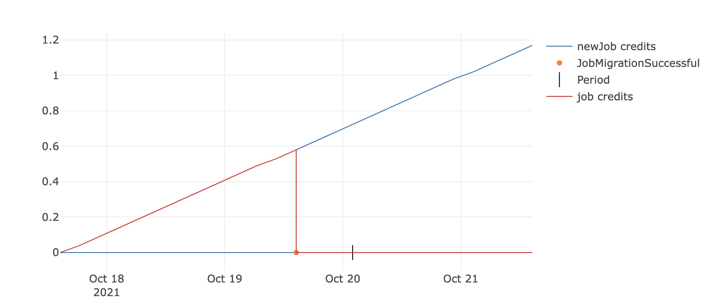

# Job Migration
There may be situations where a job needs to migrate all of their "assets" to another contract address, for a job update for example. A proper migration implies the accountancy (tokens, liquidities, period credits) from the original job address will be transferred to the new one. This process is possible, and it requires the job to call two functions:

- [`migrateJob()`](https://github.com/keep3r-network/keep3r-network-v2/blob/main/solidity/interfaces/peripherals/IKeep3rJobs.sol) first to start the migration process. This function should be call by the owner of the job that currently holds the assets to migrate.
```js
/// @notice Initializes the migration process for a job by adding the request to the pendingJobMigrations mapping
/// @param _fromJob The address of the job that is requesting to migrate
/// @param _toJob The address at which the job is requesting to migrate
function migrateJob(address _fromJob, address _toJob) external;
```

- [`acceptJobMigration()`](https://github.com/keep3r-network/keep3r-network-v2/blob/main/solidity/interfaces/peripherals/IKeep3rJobs.sol) to complete the migration process. This function should be call by the owner of the job that will receive the assets to migrate.
```js
/// @notice Completes the migration process for a job
/// @dev Unbond/withdraw process doesn't get migrated
/// @param _fromJob The address of the job that requested to migrate
/// @param _toJob The address to which the job wants to migrate to
function acceptJobMigration(address _fromJob, address _toJob) external;
```

There are some considerations the job wishing to migrate must take into account to prevent the functions from reverting:
- It must not provide its current address as the address where it wants to migrate to when calling migrateJob.
- Calls to both migrateJob and acceptJobMigration should be done with the same arguments. 
- Neither of the jobs involved in the migration process should be disputed
- It must wait at least one minute between migrations
Here's a graphic representation to visualize the resulting changes in the credits of a job that goes through a successful migration.


