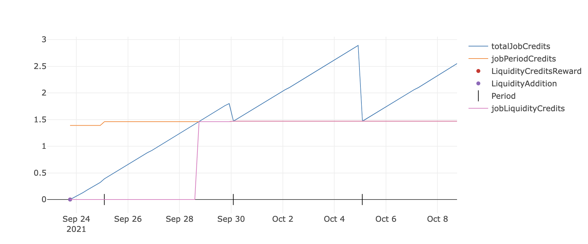
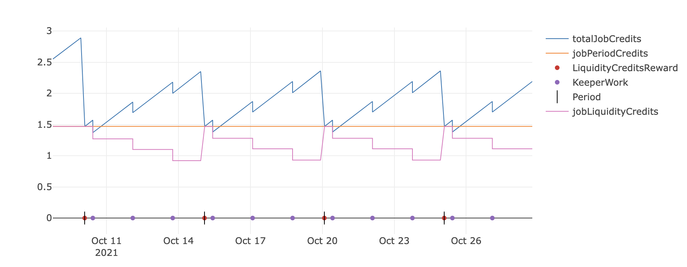
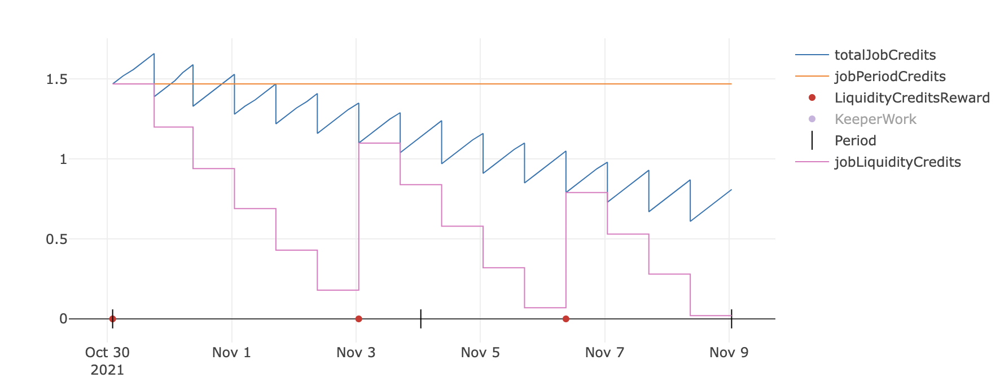
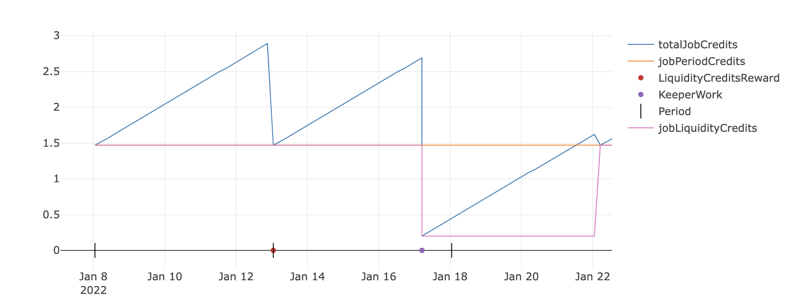
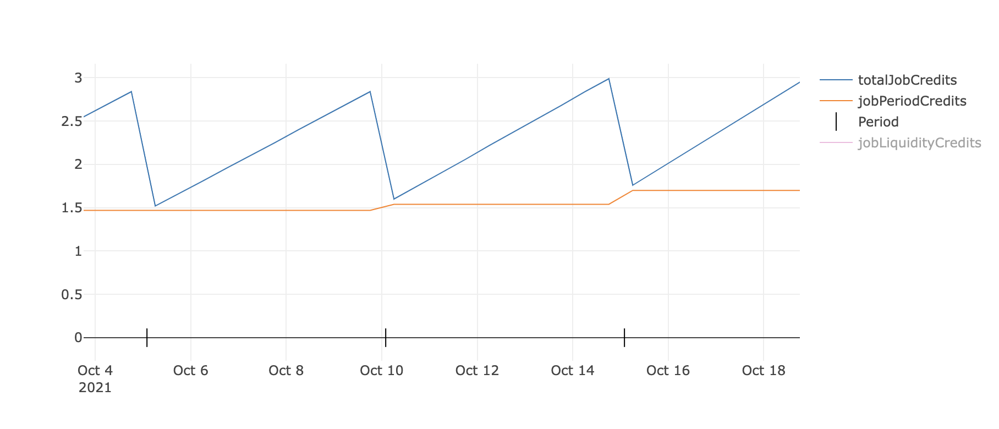
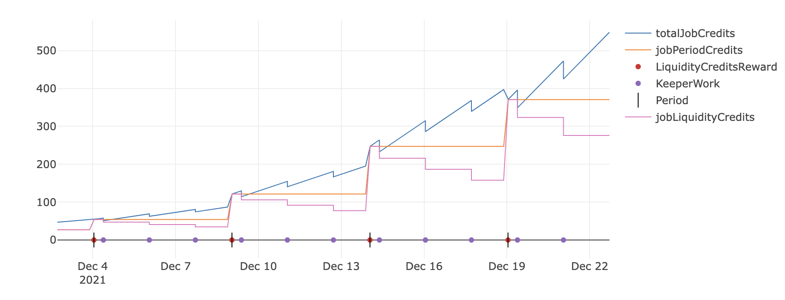

# Credit Mining

### Job Credits

A Job can generate new credits with time, by bonding Keep3r Liquidity Pool tokens `kLP` to it. Liquidities will be handled by the [Keep3r Liquidity Pools](../keep3r-liquidity-pools/README.md).

Once `kLPs` are added to a job with [`addLiquidityToJob`](../../technical/peripherals/IKeep3rJobFundableLiquidity.md#addliquiditytojob-address-_job-address-_liquidity-uint256-_amount-external), the job starts immediately to mine new KP3R credits, that can be collectable only by the keepers, in reward for working the job. The credit mining system requires no further action from the `jobOwner`.

:::info
KP3R Credits can only be rewarded within the protocol, requiring an unbonding period that gives time to disputers to detect keepers and jobs that act in bad faith
:::

#### Reward Periods

To handle KP3R credits minting and quoting, **Keep3r introduces reward periods, in which KP3R quote remains stable for each pair, and gas-efficiently processed**. These quotes are used within the protocol to mint credits and reward keepers.

The underlying KP3R of the liquidity provided, should generate the same amount of KP3R every [`inflationPeriod`](../../technical/peripherals/IKeep3rParameters.md#inflationperiod-uint256-_period-external), thereby minting the proportional amount each [`rewardPeriod`](../../technical/peripherals/IKeep3rParameters.md#rewardperiodtime-uint256-_days-external) as KP3R credits for the job. These credits are only to be earned by keepers when working the job, and by the end of each `rewardPeriod`, unused credits older than previous `rewardPeriodStart` are meant to expire.

When a new `rewardPeriod` starts, the first keeper to work the first job will:

* Perform the job action
* Reward the job or update its accountance
  * Update the quote of the KP3R/WETH pool
  * Update the quotes of each of the job liquidities

Following keepers of different jobs, will have to update each job accountance \(when worked for the first time in the period\), but won't have to update the quotes of KP3R/WETH and the liquidities the first job had, since they will be already updated. 

Updating jobs accountance requires no other action from the keeper than working the job.

:::info
A `worked()` transaction that has to update quotes and reward the job is more gas-consuming, therefore has a higher keeper reward
:::

#### Quoting the Liquidity

To determine the value of a certain liquidity, Keep3r uses a TWAP calculation to get the average quote of a pair in the last completed period. The same calculation is applied to quote rewards for keepers \(that spend gas in ETH and receive KP3R rewards\), using a predefined KP3R/WETH pool as an oracle.

* A job will mint the result of [`quoteLiquidity`](../../technical/peripherals/IKeep3rJobFundableLiquidity.md#quoteliquidity-address-_liquidity-uint256-_amount-uint256-_periodcredits-external) every `rewardPeriodTime` 
* `quoteLiquidity` will use the average quote for the last `epoch`for the given liquidity
* Remaining credits will be updated to current quotes each time a `rewardPeriod` starts

#### Job Credit accountance

At every time, a job will have its **current credits** \(already rewarded and stored as [`jobLiquidityCredits`](../../technical/peripherals/IKeep3rJobFundableLiquidity.md#jobperiodcredits-address-_job-uint256-_amount-external)\) and **pending mined credits** to be rewarded \(aggregated with current credits in [`totalJobCredits`](../../technical/peripherals/IKeep3rJobFundableLiquidity.md#totaljobcredits-address-_job-uint256-_amount-external)\). 

A keeper will be able to run the job, as long as `totalJobCredits` is greater than the payment. If `jobLiquidityCredits` are not enough to pay the keeper, then the keeper will have to reward the job by rewarding the job with its mined credits.

In a normal case scenario, a job should be rewarded once every reward period starts, and burn all remaining credits from the expired period \(the one previous to the last full period\). 

In a deficitary job scenario, when the job is spending more KP3R in a period than it should be rewarded, the job will be able to keep on paying keepers, but the minting period will start to shrink, having to mint more frequently.

Each time, the reward period will be shorter, as the job is not being rewarded the full amount for a period, but only the proportional relation of the time that passed since the last reward, and the `rewardPeriod`.

Ultimately, when the job has not enough `totalJobCredits` to reward the keeper for working the job \(and some extra to pay the keeper for rewarding the credits\), the transaction will revert with `InsufficientFunds`.

#### Credits maximum spending

At particular times, a job can make a payment of up to 2 times its `jobPeriodCredits`, as long as all the credits minted have not yet expired. 

**Updating Credits**

Since quotes can change every epoch, Keep3r recalculates every period how many KP3R a job should be mined each period, aggregated by [`jobPeriodCredits`](../../technical/peripherals/IKeep3rJobFundableLiquidity.md#jobperiodcredits-address-_job-uint256-_amount-external).

Since KP3R/WETH is also stored and **stable inside periods**, keeper payments are also updated to current quotes.

#### Removing Liquidity

At any time, the `jobOwner` can withdraw the liquidity bonded to the job, provided he either removes the total of it, or that he remains a minimum allowed amount. 

To withdraw a liquidity, first has to unbond the liquidity from the job with `unbondLiquidityFromJob`, instantly diminishing the job KP3R credits proportional to the impact of removing such liquidity. After an `unbondPeriod` passes, the `jobOwner` can withdraw the liquidity tokens from the protocol with `withdrawLiquidityFromJob`.

