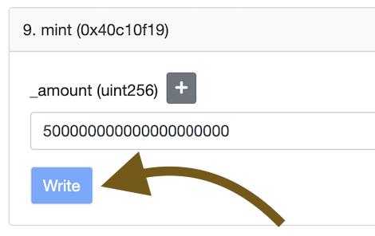
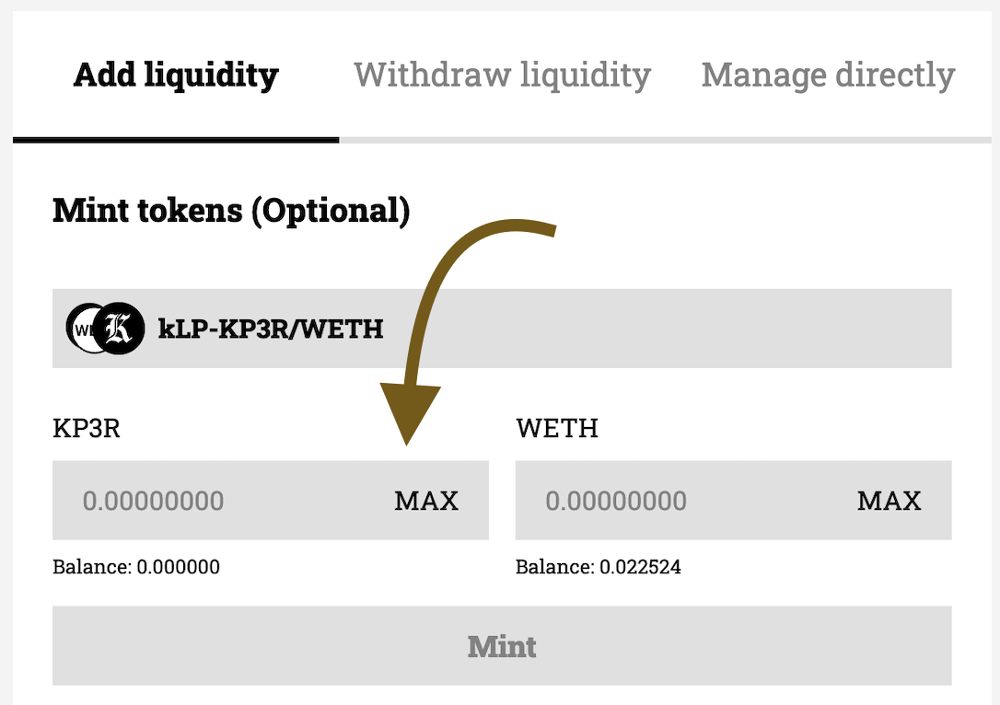
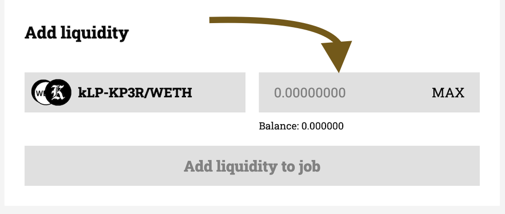

# 5a. Mining KP3R credits

This is an annex to the [Job: step-by-step](./create-a-job-step-by-step.md) guide. Do not continue without doing the previous steps beforehand.

## 1st step: Mint KP3R
1. Go to the already deployed [`KP3R` Testnet Token](https://goerli.etherscan.io/address/0x16f63c5036d3f48a239358656a8f123ece85789c#writeContract#F9) in Etherscan.
2. Connect your wallet
3. Mint `500000000000000000000` tokens  

## 2nd step: Get some `WETH`
Get at least 0.1 [`WETH`](https://goerli.etherscan.io/token/0xb4fbf271143f4fbf7b91a5ded31805e42b2208d6) in Goerli
- Use any goerli faucet to get some `ETH` or `WETH`
- In case you got `ETH`, you can use the [deposit method](https://goerli.etherscan.io/token/0xb4fbf271143f4fbf7b91a5ded31805e42b2208d6#writeContract#F5) to convert it to `WETH`

## 3rd step: Mint kLPs
1. Go to [keep3r.network](https://keep3r.network)
2. Make sure you are on Goerli Testnet network
3. Click on the job you previously deployed
4. Input the desired amount of `KP3R` and `WETH` you would like to add as underlying assets (at least `1 KP3R` and `0.1 WETH`)  

  

5. Click on approve for both `KP3R` and `WETH` tokens, and then click on _Mint_ in order to mint your `kLPs`

## 4th step: Add kLPs to your job
1. While being on the page of your job inside [keep3r.network](https://keep3r.network)
2. Input the desired amount of kLPs you want to add as liquidity to your job  

  

3. Click on _Add liquidity to job_, and then send the transaction proposed
4. You will see that the Current credits of your job will start increasing by block. You will be able to use those credits in order to pay the keepers

[Go back and continue the guide](./create-a-job-step-by-step.md)