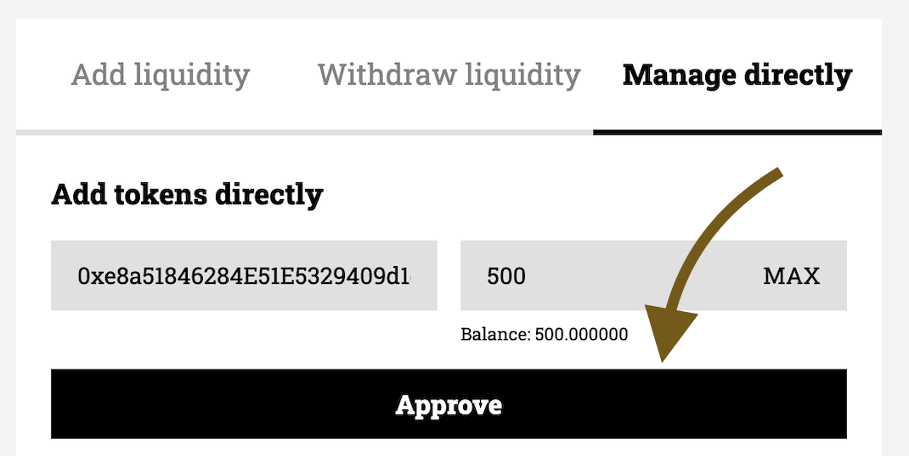

# 5b. Adding ERC20 tokens

This is an annex to the [Job: step-by-step](./create-a-job-step-by-step.md) guide. Do not continue without doing the previous steps beforehand.

## 1st step: Mint TKN-A
1. Go to the already deployed [`TKN-A` Token](https://goerli.etherscan.io/address/0xe8a51846284E51E5329409d1dF93fFAB9D5615b3#writeContract#F7) in Etherscan.
2. Connect your wallet
3. Mint `500000000000000000000` tokens with your wallet as the `_account`

## 2nd step: Add TKN-A to your job
1. Go to [keep3r.network](https://keep3r.network)
2. Make sure you are on Goerli Testnet network
3. Click on the job you previously deployed
4. Go to the tab _Manage Directly_
5. Input the desired amount of TKN-A you would like to add to your job, approve and then add the tokens  

[Go back and continue the guide](./create-a-job-step-by-step.md)
