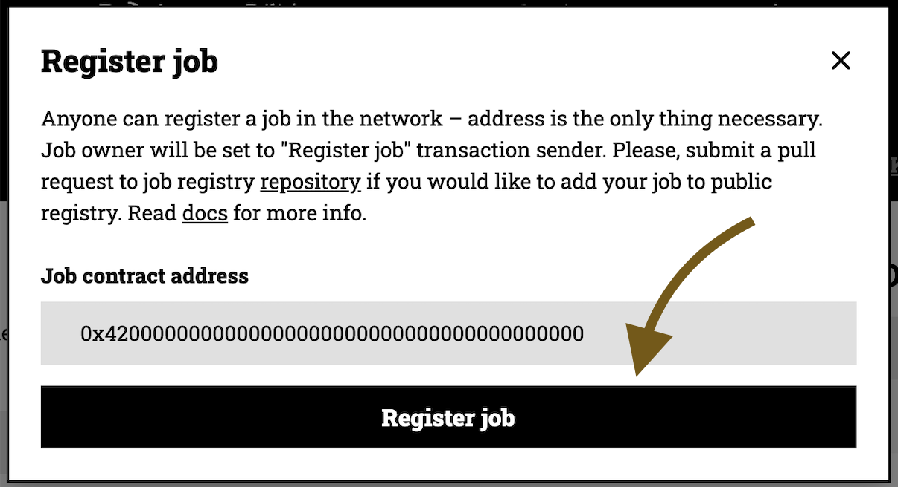
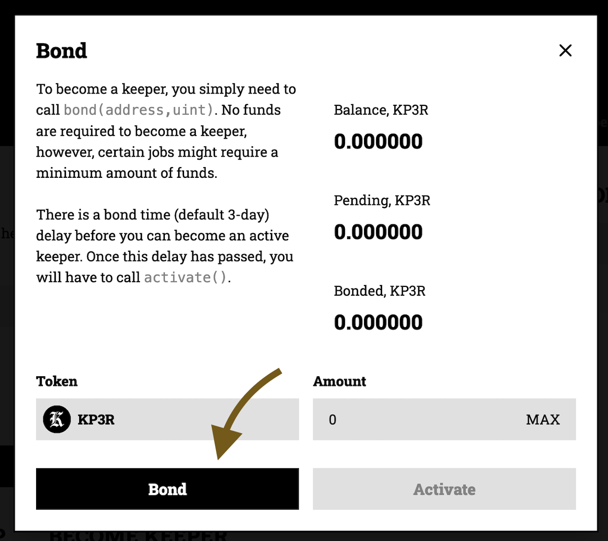
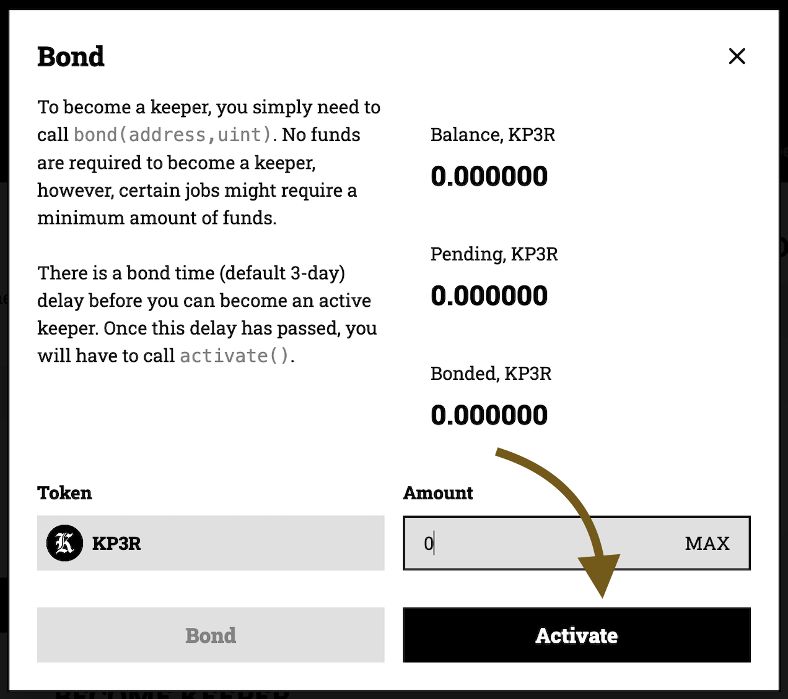

# Create a job: step by step

Every job needs a purpose. For this example, let's say that our purpose is to increase a counter by 1 unit every 15 seconds.

In order to automate this, we will create a Keep3r Job that will interact with the increase() function of the already deployed [Counter Contract](https://goerli.etherscan.io/address/0x8245184Bcaf93999C585954240eaEdB0455E8152#code).

We will be using Goerli as our network, and Foundry as our development environment.

## 1st step: Setup environment
1. Install Foundry by following the instructions from [their repository](https://github.com/foundry-rs/foundry#installation)
2. Clone [Wonderland's foundry boilerplate](https://github.com/defi-wonderland/solidity-foundry-boilerplate)
3. Install the dependencies by running: `yarn install && forge install`
4. Create a file called `.env` in the root folder of your project and add the following text. Make sure to replace the `<...>` with real values.
```bash
GOERLI_RPC=<YOUR_RPC_PROVIDER> # https url of your goerli rpc
GOERLI_DEPLOYER_PK=<YOUR_PRIVATE_KEY> # private key of the deployer
ETHERSCAN_API_KEY=<YOUR_ETHERSCAN_API_KEY> # optional, use if you want your contracts verified
```

## 2nd step: Write the Job contract
1. Create the file `solidity/contracts/MyJob.sol` and copy to it the following code:
```js
// SPDX-License-Identifier: UNLICENSED
pragma solidity >=0.8.4 <0.9.0;

import {IERC20} from 'isolmate/interfaces/tokens/IERC20.sol';

interface ICounter {
  function increase() external;
}

interface IKeep3rV2 {
  function isKeeper(address _keeper) external returns (bool _isKeeper);
  function directTokenPayment(address _token, address _keeper, uint256 _amount) external;
  function worked(address _keeper) external;
}

contract MyJob {
  // Instance of counter contract
  ICounter public counterContract = ICounter(0x8245184Bcaf93999C585954240eaEdB0455E8152);
  IKeep3rV2 public keep3r = IKeep3rV2(0x145d364e193204f8Ff0A87b718938406595678Dd);
  IERC20 public tokenA = IERC20(0xe8a51846284E51E5329409d1dF93fFAB9D5615b3);

  // Timestamp of the last time the job was worked.
  uint public lastWorkAt;
  // Amount of seconds to wait until job can work again.
  uint public workCooldown = 15;

  event Worked(address _keeper);

  // Work and reward the keeper with KP3R credits
  function workForCredits() external validateAndPayWithCredits(msg.sender) {
    work();
  }
  
  // Work and reward the keeper with TKN-A
  function workForTokens() external validateAndPayWithTokens(msg.sender) {
    work();
  }

  // Returns a boolean that indicates if a job is workable or not.
  function workable() public view returns (bool _isWorkable) {
    return block.timestamp > (lastWorkAt + workCooldown);
  }
  
  // Here we will call the main function we want keepers to execute for us.
  // In this case we want to call the function increase().
  function work() private {
    require(workable(), 'Job is not workable');
    counterContract.increase();
    emit Worked(msg.sender);
  }
  
  // Modifier in charge of verifying if the caller is a registered keeper as well as
  // rewarding them with an amount of KP3R equal to their gas spent + premium.
  modifier validateAndPayWithCredits(address _keeper) {
    require(keep3r.isKeeper(_keeper), 'Keeper is not valid');
    _;
    keep3r.worked(_keeper); // Pays the keeper for the work.
  }
  
  // Modifier in charge of verifying if the caller is a registered keeper as well as
  // rewarding them with an amount of KP3R equal to their gas spent + premium.
  modifier validateAndPayWithTokens(address _keeper) {
    require(keep3r.isKeeper(_keeper), 'Keeper is not valid');
    _;
    keep3r.directTokenPayment(address(tokenA), _keeper, 1 ether); // Pays the keeper for the work
  }
}
```
2. On your editor's console run: `forge build`. There should be no errors.


## 3rd step: Deploy job to Goerli Testnet
1. Replace the file `solidity/scripts/Deploy.sol` with:
```js
// SPDX-License-Identifier: UNLICENSED
pragma solidity >=0.8.4 <0.9.0;

import {Script} from 'forge-std/Script.sol';
import {MyJob} from 'contracts/MyJob.sol';

contract DeployGoerli is Script {
  function run() external {
    vm.startBroadcast();
    new MyJob();
    vm.stopBroadcast();
  }
}
```
2. Open `package.json` file and add this line to the scripts object:
```bash
"deploy:goerli": "bash -c 'source .env && forge script DeployGoerli --rpc-url $GOERLI_RPC --broadcast --private-key $GOERLI_DEPLOYER_PK --verify --etherscan-api-key $ETHERSCAN_API_KEY'",
```

3. On the terminal run: `yarn deploy:goerli`
4. Save the deployed Contract Address, you will need it multiple times afterwards

## 4th step: Add Job to the Keep3r Network
1. Go to [keep3r.network](https://keep3r.network)
2. Make sure you are on Goerli Testnet network
3. Click on _Register job_ and add the address of the contract your previously deployed. Send the transaction proposed


## 5th step: Add credits to your job
If you want keepers to work your job, you will need to provide them with incentives.

These incentives can either be KP3R credits or any other ERC20 you want.

Paying in KP3R credits is usually the most beneficial for a job owner, since it takes advantage of the [Credit Mining Mechanism](../tokenomics/job-payment-mechanisms/credit-mining.md). Deposit some WETH and KP3R and generate some KP3R credits every block.

Paying in ERC20 tokens is also possible by adding tokens to a job.
In order to complete this step, choose the payment method you want and complete the relevant step by step guide:
- [5a. Mining KP3R credits](./create-a-job-step-by-step.5a.md)
- [5b. Adding ERC20 tokens](./create-a-job-step-by-step.5b.md)


## 6th step: Make yourself a keeper
1. Go to [keep3r.network](https://keep3r.network)
2. Make sure you are on Goerli Testnet network
3. Click on the `Bond` button, input 0 as amount, and click on the `Bond` button of the modal. Send the transaction proposed. 


4. On production, keepers have a bonding period in order to activate, but in testnets is set to 0, so just go ahead and activate your keeper. Refresh the site, click on the `Bond` button and then click on the Activate button of the modal. Send the proposed transaction.


## 7th step: Work the job
Keepers will usually have automated scripts looking for workable jobs in order to earn some profit. In order to keep this example simple, we will work the job manually.

1. Go to your deployed job in Etherscan
2. Connect your wallet
3. If you went though part [5a. Mining KP3R credits](./create-a-job-step-by-step.5a.md):
  - Send a transaction to the function `workForCredits`
  - Looking 
4. If you went though part [5b. Adding ERC20 tokens](./create-a-job-step-by-step.5b.md):
  - Send a transaction to the function `workForTokens`
  - Looking at your transaction you should see that you got 1 TKN-A for your hard work as a keeper

If you would like to learn how to be a keeper, automate work transactions, and earn profit of it, follow the step by step guide in [How to become a keeper](./become-a-keeper-step-by-step).

:::info
Jobs by default appear as "Unverified Job" on the site. Follow this guide in order to verify your job (only on production).
:::